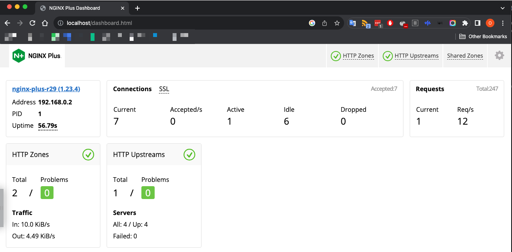
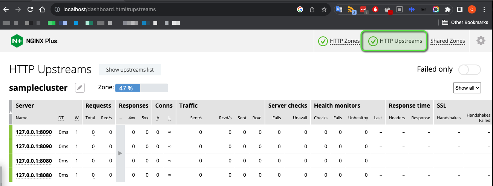

Basic Nginx Plus configuration (container) with upstream sample configuration.

Note: Need to have Nginx Plus license to run this container.
License can be obtained from https://www.nginx.com/free-trial-request/

Copy license files:
*   nginx-repo.crt
*   nginx-repo.key  

to current directory.

Build image:
```
docker build --secret id=nginx-key,src=nginx-repo.key --secret id=nginx-crt,src=nginx-repo.crt -t mynginxplus .
```

Run container:
```
docker compose up -d
```

Dashboard is available at http://localhost/dashboard.html

Dashboard:


Upstream configuration:


reference
https://docs.nginx.com/nginx/admin-guide/installing-nginx/installing-nginx-docker/#running-nginx-plus-in-a-docker-container